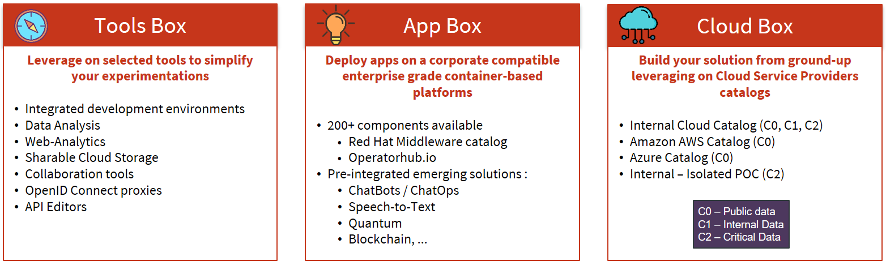

# Cloud Innovation Platform by Societe Generale

This repository provides everything you need to deploy our *Cloud Innovation Platform* on the supported
Cloud Service Providers Offers. 

## Why we created this platform?

There are already many valuable services available on Internet so why create a new platform? 
Because we couldn't find the perfect fit for our needs! Read on!

-   **Portability**

    We have an hybrid cloud strategy. We build our own internal cloud services and leverage on major public cloud service providers. Workloads can be deployed on the internal, the external or across both environments if it make sense.

    We also want to avoid as possible to be vendor-locked. Deploying our Cloud Innovation Platform both internaly and on selected cloud service providers allow us to offer to our Service & Business Units the choice to leverage on a broader range of services and solutions for their apps.

-   **Security**

    No doubt that cloud services available are or can be configured to suit most security needs. But we wanted to build from ground-up a platform that could be designed, implemented and operated in a **DevSecOps / NoOps** approach. And we wanted to have more control on which options are available to our Cloud Innovation Platform users. 
    
-   **Traceability & auditability**

    All incoming and outgoing network traffic must be logged, analyzed on the fly and stored for post-processing. Cloud Service Providers have solutions to do this but it requires a lot of technical background. Our Cloud Innovation Platform was built technical and non-technical users.

Convinced? Please help us by contributing to this project if you share views and thoughts!

## Products

The Cloud Innovation Platform is built on three product families as depicted below:

-   **Tools Box:** Various tools to help consumers onboard on the platform or be more effective developing their apps or whatever their minimal viable product is. 
-   **App Box:** A Kubernetes-based approach allowing users to concentrate on developing their code rather than struggling with underlying infrastructure components.
-   **Cloud Box:** A ground-up approach using internal or external cloud service providers' service catalogs for users to build the desired technical architecture that suits their needs. 

## What will be open sourced?

Societe Generale is commited to open source, so we want to release as much *Cloud Innvation Platform code* as possible. The first modules to be open sourced are depicted in the picture below.

## Getting started
The best way to start is to look at the reference-architecture directory content
and choose the design that's closer to your needs.

# Contributing

To contribute follow Git Flow guidelines : [Git Flow Cheatsheet](http://danielkummer.github.io/git-flow-cheatsheet/).

In a nutshell :

-   first, look at the opened issues to find out if topic you would like to work on is already discussed
-   if you can't find one, create a new one and explain it (bug, request for enhancement, etc.)
-   fork this repo to get your own copy to work on
-   create a new branch on your forked repo
-   push your commits into that branch
-   open your fork in github.com
-   create a PR based on this new branch.

Since your repo is a forked repo github will create a pull request on the societe-generale repository and then it's our job to review it and merge it !

Keeping your fork in sync with societe-generale repo please refer to those 2 documents : https://help.github.com/articles/configuring-a-remote-for-a-fork/ https://help.github.com/articles/syncing-a-fork/

